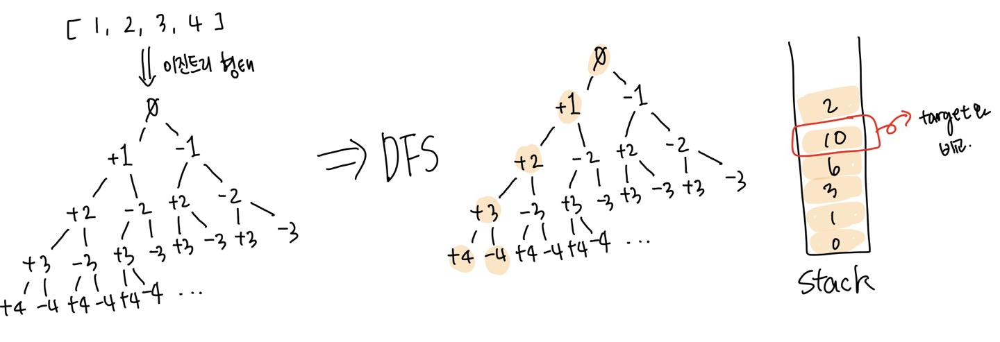

<details>
  <summary><font size= "4">문제</font></summary>
  
   n개의 음이 아닌 정수들이 있습니다. 이 정수들을 순서를 바꾸지 않고 적절히 더하거나 빼서 타겟 넘버를 만들려고 합니다. 예를 들어 [1, 1, 1, 1, 1]로 숫자 3을 만들려면 다음 다섯 방법을 쓸 수 있습니다. 

    <aside style="background-color: #f0f0f0">
        -1+1+1+1+1 = 3 <br/>
        +1-1+1+1+1 = 3 <br/>
        +1+1-1+1+1 = 3 <br/>
        +1+1+1-1+1 = 3 <br/>
        +1+1+1+1-1 = 3 <br/>
    </aside>

    사용할 수 있는 숫자가 담긴 배열 numbers, 타겟 넘버 target이 매개변수로 주어질 때 숫자를 적절히 더하고 빼서 타겟 넘버를 만드는 방법의 수를 return 하도록 solution 함수를 작성해주세요.

   <br><br>

</details>
    
<details> 
    <summary><font size= "4">제한조건</font></summary>

    <ul>
        <li> 주어지는 숫자의 개수는 2개 이상 20개 이하입니다. </li>
		<li> 각 숫자는 1 이상 50 이하인 자연수입니다. </li>
        <li> 타겟 넘버는 1 이상 1000 이하인 자연수입니다. </li>
    </ul>
    
    <br>

</details>

<details>
  <summary><font size= "4">입출력 예시</font></summary>

    <table>
        <tr>
            <td>numbers</td>
            <td>target</td>
            <td>return</td>
        </tr>
        <tr>
            <td>[1, 1, 1, 1, 1]</td>
			<td>3</td>
            <td>5</td>
        </tr>
		<tr>
            <td>[4, 1, 2, 1]</td>
			<td>4</td>
            <td>2</td>
        </tr>
    </table>

</details>

---

### C#

이진트리 깊이 우선 탐색(DFS)을 활용해 [+][-]를 했을 때의 결과를 비교, target값 동일할 때의 개수를 확인 넘겨주는 방식으로 진행한다. 



1. 이진 트리를 생성한다. (인덱스 == 레벨)
2. DRL(전위 순회 )하며 하위 자식과 합한 값을 stack에 넣는다. 
3. 순회를 마친 노드는 스택에서 제거한다
4. 최하위 레벨에 있는 노드의 합이 target과 같은 경우 카운트를 1 증가한다. 
5. 모든 순회를 마치고 카운트 값을 반환한다. 


```csharp
using System;
using System.Collections.Generic;

public class TreeNode
{
	public TreeNode(int num)
	{
		Number = num;
		LeftNode = null;
		RightNode = null;
	}

	public int Number;
	public TreeNode LeftNode;
	public TreeNode RightNode;
}

public class Solution
{
	int answer = 0;
	int targetNum = 0;

	Stack<int> traversalSum = null;

	public int solution(int[] numbers, int target)
	{
		targetNum = target;

		traversalSum = new Stack<int>();
		traversalSum.Push(0);

		TreeNode rootNode = new TreeNode(0);
		InitBinaryTree(rootNode, 0, numbers, numbers.Length - 1);

		CheckedSum(rootNode);

		return answer;
	}

	private void InitBinaryTree(TreeNode node, int index, int[] numbers, int max)
	{
		if (index == max)
		{
			if (node.LeftNode == null)
				node.LeftNode = new TreeNode(numbers[index]);

			if (node.RightNode == null)
				node.RightNode = new TreeNode(numbers[index] * -1);
			return;
		}

		if (node.LeftNode == null)
		{
			node.LeftNode = new TreeNode(numbers[index]);
			InitBinaryTree(node.LeftNode, index + 1, numbers, max);
		}

		if (node.RightNode == null)
		{
			node.RightNode = new TreeNode(numbers[index] * -1);
			InitBinaryTree(node.RightNode, index + 1, numbers, max);
		}
	}


	private void CheckedSum(TreeNode node)
	{
		if (node.LeftNode == null)
		{
			if (traversalSum.Pop() == targetNum)
                answer++;
            
			return;
		}

		else
		{
			traversalSum.Push(traversalSum.Peek() + node.LeftNode.Number);
			CheckedSum(node.LeftNode);
		}

		if (node.RightNode != null)
		{
			traversalSum.Push(traversalSum.Peek() + node.RightNode.Number);
			CheckedSum(node.RightNode);
		}

		traversalSum.Pop();
	}
}
```
[성공]
배열의 인덱스를 이진트리의 레벨 값으로 옮기는 과정이 힘들었지만 성공! 

풀고 나서 다른 사람의 풀이를 보니 훨씬 간단하게 푸는 과정이 있었다.
재귀함수... 더 많이 공부해야겠다...!

```csharp
using System;

public class Solution
{
	static int DFS(int[] arr, int target, int idx, int num)
	{
		if (idx == arr.Length)
		{
			if (target == num) return 1;
			else return 0;
		}
		else
			return DFS(arr, target, idx + 1, num + arr[idx]) + DFS(arr, target, idx + 1, num - arr[idx]);
	}

	public int solution(int[] numbers, int target)
	{
		return DFS(numbers, target, 0, 0);
	}
}
```
마지막 depth가지 내려갔다가, [+]연산, [-]연산을 하고, 한 단계 위 depth에서 다시 [+], [-] 연산을 반복함.
재귀함수 이후 재귀함수 호출 전 상태로 돌아온다는 것을 잘 이용하기!!

---
> ### [프로그래머스에서 문제 확인](https://school.programmers.co.kr/learn/courses/30/lessons/43165)
