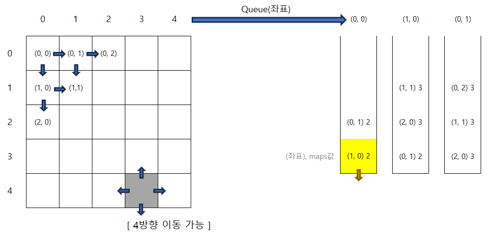

<details>
  <summary><font size= "4">문제</font></summary>
  
   

   <br><br>

</details>
    
<details> 
    <summary><font size= "4">제한조건</font></summary>

    <ul>
        <li> maps는 n x m 크기의 게임 맵의 상태가 들어있는 2차원 배열로, n과 m은 각각 1 이상 100 이하의 자연수입니다. </li>
		<li> n과 m은 서로 같을 수도, 다를 수도 있지만, n과 m이 모두 1인 경우는 입력으로 주어지지 않습니다. </li>
        <li> maps는 0과 1로만 이루어져 있으며, 0은 벽이 있는 자리, 1은 벽이 없는 자리를 나타냅니다. </li>
		<li> 처음에 캐릭터는 게임 맵의 좌측 상단인 (1, 1) 위치에 있으며, 상대방 진영은 게임 맵의 우측 하단인 (n, m) 위치에 있습니다. </li>
    </ul>
    
    <br>

</details>

<details>
  <summary><font size= "4">입출력 예시</font></summary>

    <table>
        <tr>
            <td>maps</td>
            <td>answer</td>
        </tr>
        <tr>
            <td>[[1,0,1,1,1],[1,0,1,0,1],[1,0,1,1,1],[1,1,1,0,1],[0,0,0,0,1]]</td>
			<td>11</td>
        </tr>
		<tr>
            <td>[[1,0,1,1,1],[1,0,1,0,1],[1,0,1,1,1],[1,1,1,0,0],[0,0,0,0,1]]</td>
			<td>-1</td>
        </tr>
    </table>

</details>

---

### C#

너비 우선 탐색(BFS)을 활용하여 최단 경로를 구하고자 함.



이미 탐색이 완료된 곳과 탐색해야할 곳을 구분하기 위해 탐색을 할 때마다 depth를 하나씩 업데이트 함. <br/>
최단 경로를 구해야하기 때문에 이미 탐색한 곳이라도 depth가 더 낮으면 낮은 depth로 덮어쓰기함. <br/>

큐의 구성 : Queue(i좌표, j좌표, depth)

```csharp
using System;
using System.Collections.Generic;

class Solution
{
	private int[,] _maps;

	public int solution(int[,] maps)
	{
		_maps = maps;

		int max_i = maps.GetLength(0);
		int max_j = maps.GetLength(1);

		Queue<(int, int, int)> queue = new Queue<(int, int, int)>(); // i, j, depth
		queue.Enqueue((0, 0, 1));

		while (queue.Count > 0)
		{
			var curdata = queue.Dequeue();

			int i = curdata.Item1;
			int j = curdata.Item2;
			maps[i, j] = curdata.Item3;

			int depth = maps[i, j] + 1;

			if (i + 1 < max_i && isAdd(i + 1, j, depth))
				queue.Enqueue((i + 1, j, depth));

			if (j + 1 < max_j && isAdd(i, j + 1, depth))
				queue.Enqueue((i, j + 1, depth));

			if (i - 1 >= 0 && isAdd(i - 1, j, depth))
				queue.Enqueue((i - 1, j, depth));

			if (j - 1 >= 0 && isAdd(i, j - 1, depth))
				queue.Enqueue((i, j - 1, depth));
		}

		return maps[max_i - 1, max_j - 1] == 1 ? -1 : maps[max_i - 1, max_j - 1];
	}

	public bool isAdd(int i, int j, int depth)
	{
		if (_maps[i, j] != 0)
		{
			return _maps[i, j] == 1 || _maps[i, j] > depth;
		}
		return false;
	}
}
```
[실패]

정확성 테스트는 성공했으나 시간초과로 효율성 테스트 실패 
<br/>
<br/>

```csharp
using System;
using System.Collections.Generic;

class Solution
{
	private int[,] _maps;

	public int solution(int[,] maps)
	{
		_maps = maps;

		int max_i = maps.GetLength(0);
		int max_j = maps.GetLength(1);

		Queue<(int, int)> queue = new Queue<(int, int)>(); // i, j, depth
		queue.Enqueue((0, 0));

		while (queue.Count > 0)
		{
			var curdata = queue.Dequeue();

			int i = curdata.Item1;
			int j = curdata.Item2;

			int depth = maps[i, j] + 1;

			if (i + 1 < max_i && isAdd(i + 1, j, depth))
				queue.Enqueue((i + 1, j));

			if (j + 1 < max_j && isAdd(i, j + 1, depth))
				queue.Enqueue((i, j + 1));

			if (i - 1 >= 0 && isAdd(i - 1, j, depth))
				queue.Enqueue((i - 1, j));

			if (j - 1 >= 0 && isAdd(i, j - 1, depth))
				queue.Enqueue((i, j - 1)); 
		}
		return maps[max_i - 1, max_j - 1] == 1 ? -1 : maps[max_i - 1, max_j - 1];
	}

	private bool isAdd(int i, int j, int depth)
	{
		if (_maps[i, j] != 0)
		{
			if(_maps[i, j] == 1 || _maps[i, j] > depth)
			{
				_maps[i, j] = depth; //방문처리
				return true;
			}
		}
		return false;
	}
}
```
[성공]

isAdd 시점에 true이면 무조건 큐에 추가를 하는거니까 true일 때 _maps[i, j]를 업데이트해 방문 처리를 하도록 수정함. depth을 큐에서 관리할 필요가 없어서 튜플 요소 개수를 줄일 수 있음. 

---
> ### [프로그래머스에서 문제 확인](https://school.programmers.co.kr/learn/courses/30/lessons/1844)
