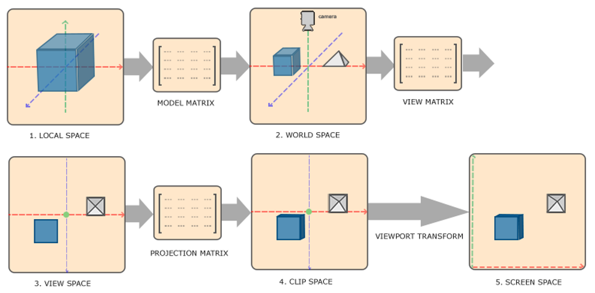
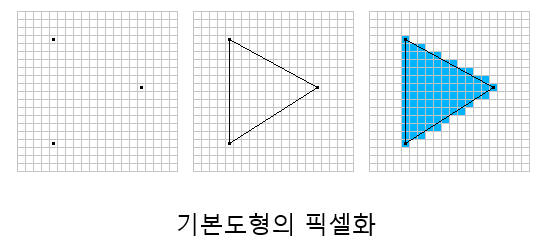
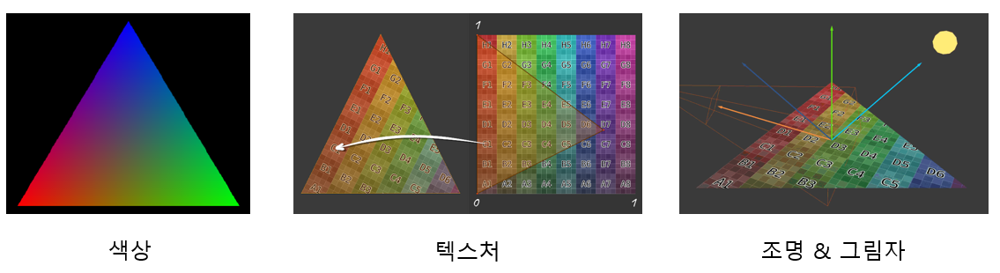
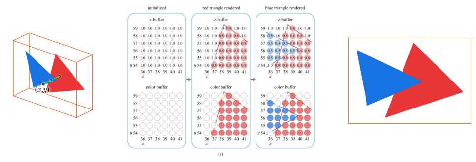

# 랜더링 파이프라인

3차원의 세계를 2차원으로 표현하는 작업으로, 각 단계를 파이프라고 부른다. 
랜더링 파이프라인의 단계를 병렬처리에 특화된 GPU를 통해 진행된다. 

[랜더링 파이프라인 순서]  
입력 조립 → 정점 셰이더 → 레스터라이저 → 픽셀 셰이더 → 출력 병합 

## 입력 조립 (Input Assembler)

3D 장면의 정보를 CPU가 GPU에게 전달해 기본 도형으로 조립하는 단계이다. 

3D 장면에서 표현되는 오브젝트들은 위치, 색상 법선, UV등 정점들의 정보로 구성되어 있다. CPU는 메시를 그리기 위해 필요한 정점의 정보를 정점 버퍼 형태로 GPU에 전달하고, 정점 버퍼를 전달받은 GPU는 정점 서설자에게 정의된 규칙으로 정점 데이터로 조립한다.
이후 정점 데이터를 다른 파이프라인 단계에서 사용 가능하도록 삼각형과 같은 기본 도형으로 조립힌다. 

 
오브젝트를 삼격항으로 나누는 이유? 

&nbsp;&nbsp;&nbsp;● 삼각형은 세 점으로 정의 되어 있고, 평면 상에서 간단하게 표현이 가능하다.  
&nbsp;&nbsp;&nbsp;&nbsp;&nbsp;&nbsp;&nbsp;&nbsp;이는 다시 말하면 삼각형의 정점 좌표를 계산하기 쉽다는 의미가 된다. 
&nbsp;&nbsp;&nbsp;&nbsp;&nbsp;&nbsp;&nbsp;&nbsp;따라서 삼각형을 렌더링 할 대 가장 효율적으로 처리가 가능하다.   
&nbsp;&nbsp;&nbsp;● 다양한 형상의 오브젝트를 삼격형으로 나누면 곡면 근사화가 쉽다.   
&nbsp;&nbsp;&nbsp;&nbsp;&nbsp;&nbsp;&nbsp;&nbsp;삼각형은 평면에 대해 수학적 계산이 간단하며 다양한 곡면을 근사화 할 수 있다. &nbsp; 
&nbsp;&nbsp;&nbsp;● 삼격형은 그룹화 되어 복잡한 형상을 간소화 할 수 있다.  
&nbsp;&nbsp;&nbsp;&nbsp;&nbsp;&nbsp;&nbsp;&nbsp;삼각형 스트립(triangle strip)과 같은 방법을 사용해 연속된 삼각형을 그릴 수 &nbsp;있다.  
&nbsp;&nbsp;&nbsp;&nbsp;&nbsp;&nbsp;&nbsp;&nbsp;이를 통해 중복을 점점 줄이고 랜더링 성능을 향상 시킬 수 있다.  
&nbsp;&nbsp;&nbsp;● 업계에서 표준화 된 방법으로 채택되어 왔다.  
&nbsp;&nbsp;&nbsp;&nbsp;&nbsp;&nbsp;&nbsp;&nbsp;이 때문에 대부분의 GPU나 랜더링 소프트웨어가 삼각형 렌더링에 최적화 되어 있다.

## 정점 셰이더 (Vertex Shader)

점들의 위치를 결정해주는 단계로, 게임 월드 상에서의 위치를 결정한다.

데이터의 공간 변환을 수행하여 3D 공간 상의 정점의 위치를 클립 공간으로 옮기는 단계다. 
변환은 행렬 연산을 통해 이뤄지며 변환 렬은 Model, View, Projection으로 총 3가지다.

행렬 연산 특징 상 결합 법칙이 성립 된다.  
Model, view, projection 메트릭스를 미리 곱해둔 상태에서 어떠한 오브젝트가 오면 결과물만 곱해서 빠르게 처리하기 때문에 단계는 많으나 연산이 그리 많이 들어가지 않다.

## 레스터라이저 (Rasterizer)

3D구성을 픽셀로 변환하는 단계로 정점 데이터의 프래그먼트(Fragment) 구성, 화면에 출력할 픽셀을 구성한다.
그래픽 하드웨어의 자체 알고리즘으로 동작하며, 프로그래밍이 불가능한 고정 파이프라인 단계로 직접적으로 개입할 수 없다. 

레스터라이저 단계를 거쳐 기본도형은 픽셀로 변환되며, 각 정점을 기준으로 보간이 진행된다.

## 픽셀 셰이더 (Pixel Shader)

도형의 색상을 추출하는 단계이다.  
레스터라이저는 어떤 데이터를 갖게 되는지 픽셀간의 연결고리만 그리는 것이고 실제 어떤 색상을 입힐지는 픽셀 셰이더에서 정한다.

화면을 구성하는 기본도형을 구성하는 각 픽셀마다 픽셀 셰이더를 한 번씩 호출하며 픽셀데이터(깊이 값, 색상 값)을 계산하여 다음 단계로 전달한다.

## 출력 병합 (Output Merger)

표시되는 픽셀을 결정하고 최종 픽셀 색을 혼합하는 픽셀 병합 단계이다.

각각의 픽셀 위치마다 여러 기본 도형의 픽셀이 겹칠 때 이렇게 겹치는 픽셀들을 연산 및 판단하여 픽셀의 최종적인 색상을 결정한다.  
픽셀들을 화면에 출력하기 위한 알파 블랜딩(Alpha Blending), 스탠실 테스트(Stencil Test) 연산을 진행한다.