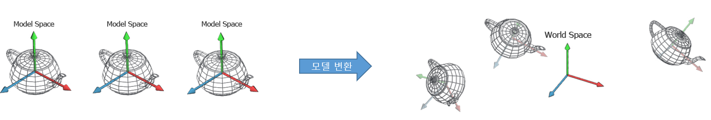
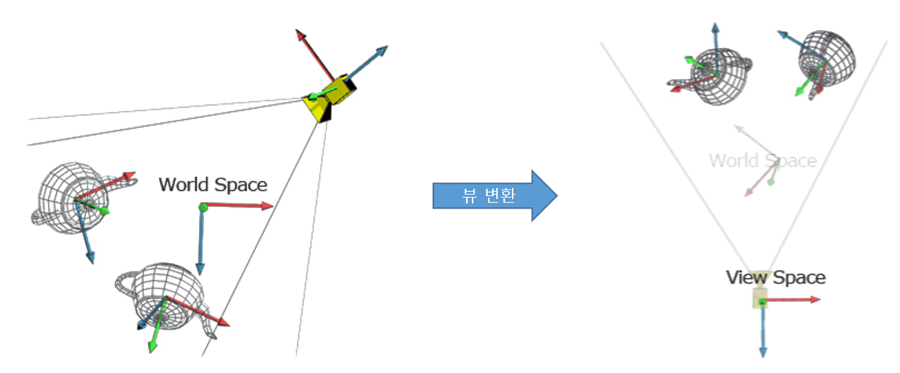
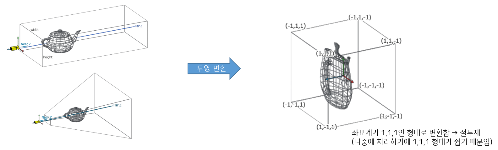

# 정점 셰이더 (Vertex Shader)

행렬 연산을 통해 정점 데이터의 공간 변환을 수행하여 3D 공간 상의 정점의 위치를 클립 공간으로 옮기는 단계이다.  
이 단계에서 게임 월드 상에서의 점들의 위치를 결정한다. 

변환은 Model, View, Projection 3가지 행렬을 거쳐 변환된다. 

1. Local Space : 오브젝트의 원점을 기준으로 함 
2. World Space : 사용자가 만든 Scene의 원점을 기준으로 함 
3. View Space : 활성 카메라의 위치를 기준으로 함 (카메라의 위치 자체를 기준으로 함.)
4. Clip Space : 카메라 필림의 중심을 기준으로 함 (카메라에 잡히는 화면을 기준으로 함.) → x, y 좌표는 카메라 필름과 평행하고, z는 깊이를 나타낸다. 
5. Screen Space : 2D화면. 일반적으로 화면 왼쪽 하단 모서리가 기준으로 (0, 0)임. 

> [공간에 대한 자세한 설명](https://github.com/lettier/3d-game-shaders-for-beginners/blob/master/sections/reference-frames.md)

### 모델 변환 (Model) 
모델은 각각 자신의 기준 위치를 원점(0, 0, 0)으로 하는 좌표 공간을 가지고 있다. 이러한 각 모델의 좌표 공감을 변환하여 하나의 월드 공간으로 통합하는 과정이 바로 모델 변환 과정이다. 

* 모델 공간(Model Space = Local Space)을 월드 공간(World Space)으로 변환하는 단계
* 이 과정을 통해 이동(Translate), 회전(Rotate), 크기(Scale)변환이 이뤄진다. 
* 모델 변환은 행력의 곱을 사용해 이뤄진다. 

### 뷰 변환 (View)
모든 모델을 화면에 그려내기 쉽도록 카메라의 위치를 원점(0, 0, 0), 카메라가 바라보는 방향을 +Z축인 공간으로 변환하는 과정이다. 

* 월드 공간(World Space)을 뷰 공간(View Space)으로 변환하는 단계
* 카메라가 보는 시점 중심 

### 투영 변환 (Projection)
화면에 보이는 위치로 정점의 위치를 변하는 과정이다. 

* 뷰 공간(View Space)을 투영 공간(Projection Space)으로 변환
* 투영 변환 과정에서 절두체(Frustum, 화면에 랜더링 되어야 하는 영역)가 정의 됨.
* 원근감이 없는 직교 투영(Orthographic) 또는 원근감이 있는 원근 투영(Perspective)으로 진행 됨 

