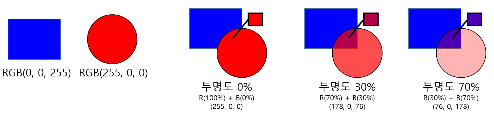

# 출력 병합 (Output Merger)

표시되는 픽셀을 결정하고 최종 픽셀 색을 혼합하기 위한 단계로, 픽셀을 병합하는 단계이다. 

각각의 픽셀 위치마다 여러 기본 도형의 픽셀이 겹쳐 있을 수 있다. 이렇게 겹쳐있는 픽셀들을 연산 및 판단하여 픽셀의 최종적인 색상을 결정할 수 있다. 

픽셀들을 화면에 출력하기 위해 알파 블랜딩(Alpha Blending), 스텐실 테스트 (Stencil Test)연산을 진행한다. 

### 알파 블랜딩 (Alpha Blending)
픽셀은 투명을 표현할 방법이 없음.  
픽셀의 투명도를 표현하기 위해서 뒤쪽에 있는 오브젝트의 색상을 섞는 방법을 투명도를 표현한다. 이를 알파 블랜딩이라고 한다.  
픽셀 색상 = 앞 오브젝트 생상 x (1 - 투명도) + 뒤 오브젝트 생상 x (투명도) 

### 스텐실 테스트 (Stencil Test)
스텐실 버퍼에 정의된 값을 사용하여 픽셀을 그리거나 그리지 않을지를 결정한다. 스텐실 테스트를 통해 스텐실 버퍼에 있는 값을 기준으로 조건을 만족하는 픽셀만 렌더링하거나 제외할 수 있다. 이를 통해 그래픽 효과를 만들거나 특정한 부분에만 렌더링을 적용할 수 있다. 

> 절두체 클리핑은 시야 내의 객체를 결정하고 제거하는 반면, 스텐실 테스트는 추가적인 조건을 적용하는데 사용 된다. 
> → 절두체 클리핑은 랜더링 대상 자체를 결정하는 작업이라면 스텐실 테스트는 렌더링 된 픽셀에 대한 추가조건에 대한 작업이다. 

