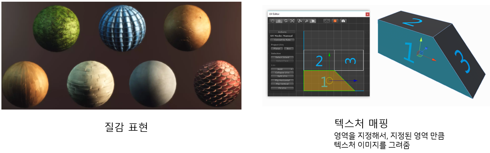
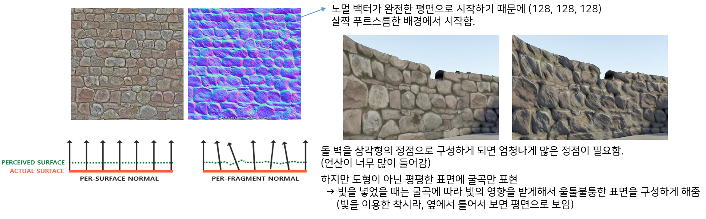
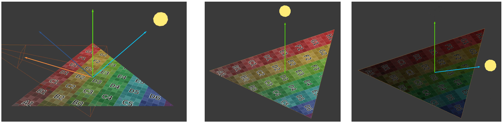

# 픽셀 셰이더 (Pixel Shader)

레스터라이저 단계에서 구해진 기본도형의 픽셀에 투명도, 조명과 그림자, 텍스처 색상을 입히는 단계이다.  
(레스터라이저 스캔 변환은 픽셀마다 어떤 데이터를 갖게 되는지 픽셀간의 연결고리만 그리는 것이고 실제 색상을 입힐지는 픽셀 셰이더에서 정한다.)
기본 도형을 구성하는 각 픽셀마다 픽셀 셰이더를 한번씩 호출한다.  
픽셀데이터(깊이 값, 색상 값)을 계산하여 다음 단계로 전달한다.  

### 텍스처 (Texture)
기본도형의 질감을 표현하는 이미지이다.  
텍스처가 매핑되어 있는 UV 좌표를 사용하여 기본도형의 그려질 픽셀에 색상을 추가한다. 
> UV좌표
> 텍스처 영역을 지정하는 좌표로, UV좌표가 있다는 말은 곧 텍스처가 진행 중이라는 말과 같다. 

### 노멀맵 (Normal Map)
표면 정보를 정점 추가 없이 표현하는 방법이다.  
텍스처와 같이 UV값을 통해 매핑되며 각 픽셀의 값으로 표면벡터를 구성하고, 표면벡터의 값을 통해 조명 및 그림자 표현을 진행하여 표면 입체감을 추가한다. 
> 표면벡터 : 픽셀별로 어느정도 기울기를 가지고 있는지에 대한 정보 즉, 굴곡 정보를 가지고 있는 벡터이다. 

### 라이트 (Light)
라이트는 광원의 위치로부터 기본도형에 반사된 빛이 카메라에 들어오는 비율을 계산하여 구현한다.  
→ 입사각 벡터와 기본도형 법선벡터를 연산하여 반사각 벡터를 구하고, 반사각 벡터와 카메라 위치 벡터사이의 내적의 값으로 비율을 구할 수 있다. 

빛은 다른 대상에 의해서 오브젝트의 색상이 결정되는 등 여러 조건들이 영향을 주기 때문에 게임에서 계산해야할 것들이 많다.  
(빛과 그림자 연산에서 가장 많은 부하가 생김)  
→ 빛이 많으면 프레임이 떨어진다. 하지만 빛이 없으면 게임 모델링 퀄리티가 떨어진다. 

**라이트 맵**
빛의 연산을 줄이기 위해 나온 방법으로, 고정된 물체 + 고정 된 빛은 그림자 값을 따로 계산하지 않고, 그림자를 확정시켜서 그냥 그리는 방법이다.  
(그람자 위치에 검은색을 그냥 그려둠) = 라이트 맵

유니티에서 라이트 맵 구현하기 

