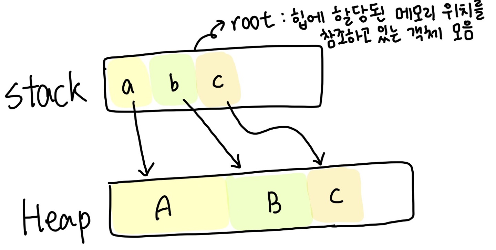
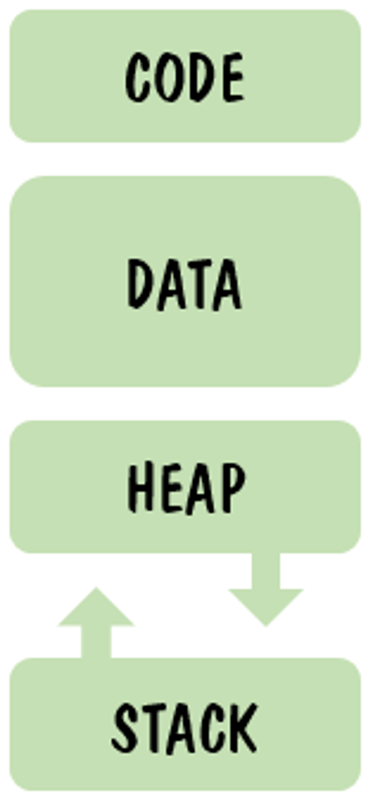

# Garbage Collection
메모리를 코드상에서 직접 관리해줘야하는 C, C++과 달리 C#은 CLR(Common Language Runtime, 공용 언어 런타임)이 자동적으로 메모리를 관리해줌. GC는 자동 메모리 관리의 중심이 되는 기능이다. 

## 메모리 할당
참조형 변수가 생성되면 Heap 메모리 영역에 객체가 할당된다.  
이 때 메모리 첫 영역부터 차례대로 할당하게 되고, 할당이 가능한 부분의 첫 주소를 포인터로 가리킨다. (메모리 할당 영역을 찾는 과정이 없어져서 처리 속도가 빨리진다)   
⇒ 스택 메모리에 주소 값을 담아두고 힙 메모리에 접근하는 방식으로 저장되어 있다.

## 메모리 해제 (GC 동작방식)
C#과 Unity의 GC 동작 방식이 다름 

해제 기준 : 할당된 메모리를 참조하는 곳이 없고, 메모리가 참조하고 있는 곳이 없으면 메모리를 해제한다.

### C# GC
* 가비지 컬렉션이 동작할때 세대별로 관리를 함  
  힙 영역에 할당된 메모리들은 0세대, 1세대, 2세대 총 3가지로 구분 된다.  
  0세대는 가장 사라질 것이라고 예상되는 것으로 처음 할당되는 메모리들이고, 2세대는 마지막에 사라질 것으로 예상되는 것들로, 오래된 객체일수록 계속 사용할 가능성이 높은 메모리들이다.  
  
* 객체의 수명은 GC를 몇번 거쳐갔는지에 따라 결정되며 GC를 많이 거칠수록 세대가 높아짐  
  GC는 0세대부터 발생하며 0세대의 메모리를 해제하고, 해제 후에도 메모리가 부족하다고 판단하면 1세대, 2세대 순서로 GC가 발생한다.  
  세대의 메모리를 해제한 후 남은 세대는 세대 수를 증가함.

* 가비지 컬렉션 진행 과정  
&nbsp;&nbsp;1. Mark : 사용되고 있는 개체를 연결하는 작업  
&nbsp;&nbsp;2. Relocate : 사용되지 않는 개체를 식별하는 작업  
&nbsp;&nbsp;3. Compact : 필요 없는 객체들을 지우고 살아있는 객체들을 모으는 작업  

* 빈번한 GC 호출은 프로그램의 성능을 저하시킬 수 있음.
  * GC 작업 중에는 애프릴케이션 스레드의 실행이 멈추는 일시 중단 현상이 발행하는데, 이러한 중단은 사용자 경험을 저해시킴.  
  * GC 작업은 추가적인 CPU 및 메모리 리소스를 요구하기 때문에 빈번한 GC 호출은 더 많은 리소스를 소비하게 됨.
  * 힙 메모리를 자주 정리하게 되며, 이로 인해 메모리 단편화 문제가 발생할 수 있음  
    (메모리 단편화 :  사용가능한 메모리가 충분히 존재하지만 할당(사용)이 불가능한 상태)

* GC를 줄이기 위한 노력이 필요함
  * 객체를 너무 많이 할당하지 않기 (Unity에서는 오브젝트 풀을 활용함)
  * 너무 큰 객체 할당하지 않기   
    (메모리 복사를 통해 객체를 압축하는 과정과 비용이 크기 때문에 대형 객체는 GC를 거친 후 해제된 공간을 그대로 두기 때문에 메모리 단편화 현상이 발생하게 된다. 또한. CLR에서 대형 객체 힙은 2세대 힙으로 간주하기 때문에 힙의 GC를 하려면 FULL GC가 일어나야 한다. → Heap영역은 SOH(Small Object Heap)와 LOH(Large Object Heap)로 구분된다. )
  * 복잡한 참조 관계 만들지 않기  
    (object의 세대를 옮기기 위해 메모리 복사를 구행하는데 복잡한 참고 관계가 있다면 참조하고 있는 모든 메모리 구조를 수정하는 과정이 필요함)
  * 루트를 많이 만들지 않기 (루트 목록 기반으로 가비지를 찾아내기 때문에 루트 목록이 줄면 순회하는 시간을 줄일 수 있음)
  
### Unity GC
유니티에서는 Mono 런타임을 사용하여 자동으로 메모리 관리를 수행한다.

[Mono런타임]  
크로스 플랫폼 소프트웨어 개발을 위한 오픈 소스 개발 플랫폼으로, 다양한 운영 체제에서 실행할 수 있는 응용 프로그램을 개발하기 위한 환경을 제공하는 소프트웨어 프레임워크입니다.

* 세대 구분보다는 참조 추적과 논리적 객체 그룹에 중점을 둠. 
* 세대 구분이 없는 대신 특정한 목적과 요구 사항에 맞게 최적화된 GC 방식을 사용함. 

1. 참조 추적 : 객체의 상호 참조를 추적, 참조되지 않는 객체를 결정함.
2. 논리적으로 관련된 객체 그룹 : 게임 오브젝트 관련 객체, 스크립트에서 생성된 객체, 리소스에서 로드된 객체 등 논리적 객체 그룹을 추적함. 

## 메모리 구조

<table>
  <tr align=center>
    <td>영역</td>
    <td>설명</td>
    <td>적용</td>
  </tr>
  <tr>
    <td>CODE</td>
    <td>실행할 프로그램의 코드가 저장되는 영역, CPU가 코드 영역에 저장된 명령어를 하나씩 처리함. 프로그램이 시작하고 종료될 때까지 메모리에 계속 남아 있음.   크키 고정</td>
    <td>상수</td>
  </tr> 
  <tr>
    <td>DATA</td>
    <td>전역(global), 정적(static) 변수가 저장되는 영역, 프로그램의 시작과 함께 할당됨. 프로그램 종료 시 소멸</td>
    <td>static 변수, 전역 변수</td>
  </tr> 
  <tr>
    <td>HEAP</td>
    <td>인스턴스가 저장되는 영역(필요에 의해 동적으로 할당), 사용하지 않을 때 GC에 의해 소멸됨. 런타임 당시에 크키가 결정됨. FIFO</td>
    <td>참조 변수</td>
  </tr> 
  <tr>
    <td>STACK</td>
    <td>지역(local)변수, 매개(parameter)변수가 저장되는 영역, 함수의 호출과 할당되며 함수의 호출이 완료되면 소멸됨. 컴파일 당시에 크기가 졀정됨. LIFO</td>
    <td>지역변수</td>
  </tr> 
</table>

**동작할당과 정적할당**

정적할당 (Static Allocation)
  * 주로 Stack 영역에서 이뤄짐
    ⇒ Stack은 간단한 LIFO 구조이기 때문에 생성및 소멸이 빠르게 처리됨. 빠른 접근 속도 제공 가능
  * 변수가 선언될 때 컴파일 시점에서 크기와 수명이 결정
  * 컴파일 시 메모리를 할당하고 크기를 결정하므로 프로그램 실행 중 메모리 크기나 수명을 동적으로 조정할 수 없음
    ⇒ 메모리 낭비 가능성이 높음.
  * 스택에 할당된 변수는 스코프(범위)를 벗어나면 자동으로 해제 됨. = 변수가 선언된 블록({ ~ })이 종료되면 자동 제거됨. (자동 메모리 관리)
    
동적할당 (Dunamic Allocation)
  * 주로 Heap 영역에서 이뤄짐.
  * 런타임 시점에 메모리가 할당되고 해제 됨. => 메모리 유연성을 제공함 
  * GC를 통해 메모리를 관리하여 메모리 누수를 방지함. (개발자가 명시적으로 메모리 해제할 필요 없음)

