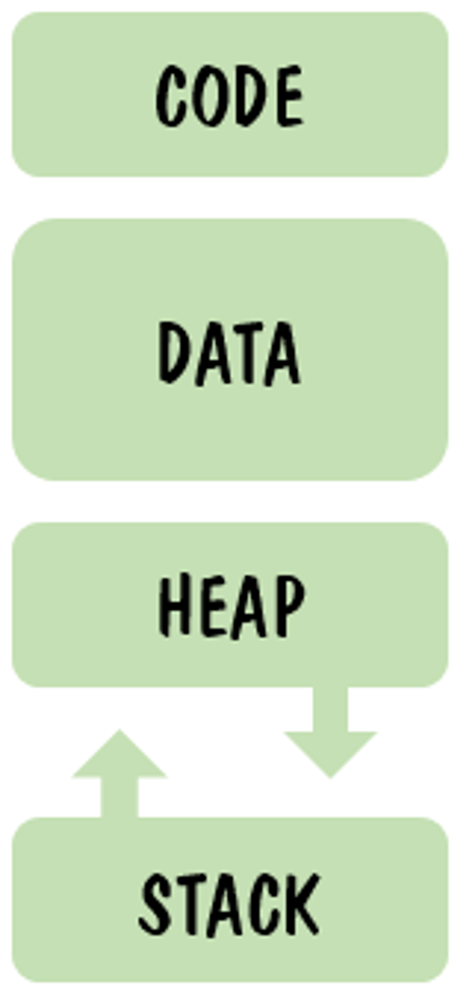

# Garbage Collection

## 메모리 구조

  

  <table>
      <tr>
        <td>영역</td>
	      <td>설명</td>
        <td>적용</td>
      </tr>
      <tr>
        <td>CODE</td>
        <td>실행할 프로그램의 코드가 저장되는 영역, CPU가 코드 영역에 저장된 명령어를 하나씩 처리함. 프로그램이 시작하고 종료될 때까지 메모리에 계속 남아 있음. 크키 고정</td>
        <td>상수</td>
      </tr> 
      <tr>
        <td>DATA</td>
        <td>전역(global), 정적(static) 변수가 저장되는 영역, 프로그램의 시작과 함께 할당됨. 프로그램 종료 시 소멸</td>
        <td>static 변수, 전역 변수</td>
      </tr> 
      <tr>
        <td>HEAP</td>
        <td>인스턴스가 저장되는 영역(필요에 의해 동적으로 할당), 사용하지 않을 때 GC에 의해 소멸됨. 런타임 당시에 크키가 결정됨. FIFO</td>
        <td>참조 변수</td>
      </tr> 
      <tr>
        <td>STACK</td>
        <td>지역(local)변수, 매개(parameter)변수가 저장되는 영역, 함수의 호출과 할당되며 함수의 호출이 완료되면 소멸됨. 컴파일 당시에 크기가 졀정됨. LIFO</td>
        <td>지역변수</td>
      </tr> 
    </table>

