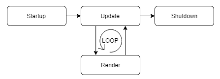

# 게임 루프 (Game Loop)
전체 게임 프로그램의 전반적인 흐름 제어로, 사용자가 종료할 때까지 게임은 일련의 작업을 계속 반복한다. <br/>
게임 루프의 반복을 **프레임**이라고 한다. 대부분의 실시간 게임은 초당 여러번 업데이터와 랜더링 작업이 일어난다. 
이 때 업데이트와 랜더링 작업이 되는 회수를 초당 프레임수라고 부른다. 가장 일반적인 간격은 30과 60이다. (60FPS = 1초에 60번 업데이트 됨) <br/>
게임속도는 1초에 업데이트가 몇 회나 호출되는지를 나타는 횟수이다. <br/>
주의할 점은 언제나 FPS와 게임속도가 동일하지 않다는 점이다. (구현 방법에 따라 의미가 구분되어지기도 한다)

### 게임 엔진 기본 흐름 
일반적으로 게임 루프는 게임이 시작한 후부터 게임이 종료되기 전까지 게임의 상태를 업데이트하고 화면에 그리는 랜더링 단계를 반복한다.



간단하게 코드로 표현하면 다음과 같다. 
```c#                                   
bool running = true;

while (running)
{
    Update();
    Render();
}
```


